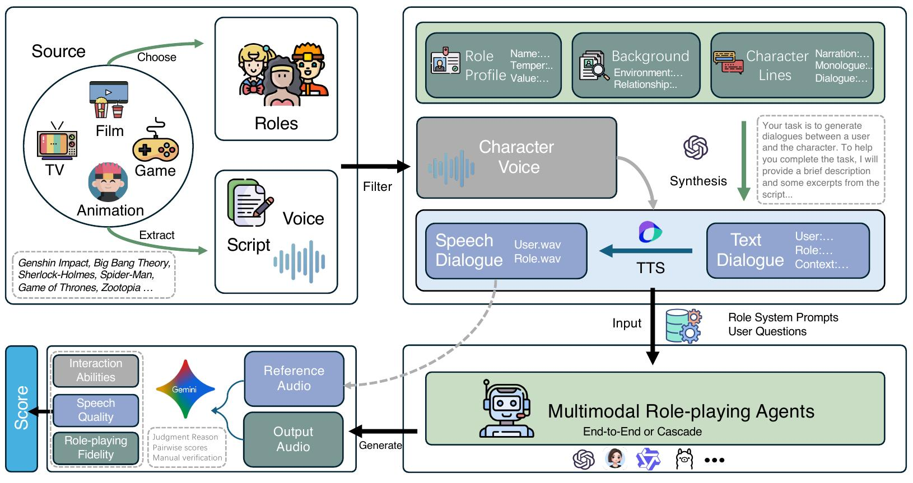

<div align="center">
    <h2> SpeechRole: A Large-Scale Dataset and Benchmark for Evaluating Speech Role-Playing Agents </h2>

<p align="center">
  <!-- <a href="https://huggingface.co">Arxiv Paper</a> • -->
  <!-- <a href="https://github.com/">Github</a> • -->
  <!-- <a href="https://huggingface.co">Huggingface</a> • -->
  <!-- <a href="#-citation">Citation</a> -->
</p>
</div>





<!-- ## 🗒️ Pre-training Data

Coming soon! -->


<!-- ## 🕸️ Model

Coming soon! -->


<!-- ## 📊 Evaluation Set

Coming soon!
``` -->


<!-- ## 📖 Citation

If you find our code or paper helps, please consider citing:

```bibtex

``` -->

