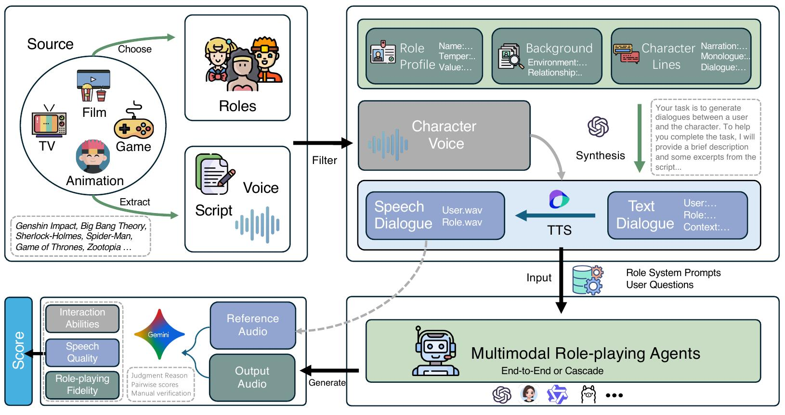

<div align="center">
    <h2> SpeechRole: A Large-Scale Dataset and Benchmark for Evaluating Speech Role-Playing Agents </h2>

<p align="center">
  <a href="https://arxiv.org/abs/2508.02013v1">Paper</a> •
  <a href="https://huggingface.co/datasets/yuhui1038/SpeechRole-Eval">Benchmark</a> •
  <a href="https://huggingface.co/datasets/yuhui1038/SpeechRole-Data">Data</a> •
  <a href="https://huggingface.co/yuhui1038/SpeechRole-Agent">Model</a> •
  <a href="#-citation">Citation</a>
</p>




## 📖 Citation

If you find our code or paper helps, please consider citing:

```bibtex
@article{jiang2025speechrole,
  title={SpeechRole: A Large-Scale Dataset and Benchmark for Evaluating Speech Role-Playing Agents},
  author={Jiang, Changhao and Sun, Jiajun and Cao, Yifei and Zhuang, Jiabao and Li, Hui and Fan, Xiaoran and Zhang, Ming and Ye, Junjie and Dou, Shihan and Xi, Zhiheng and others},
  journal={arXiv preprint arXiv:2508.02013},
  year={2025}
}
```
